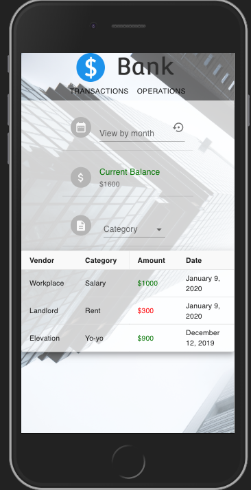
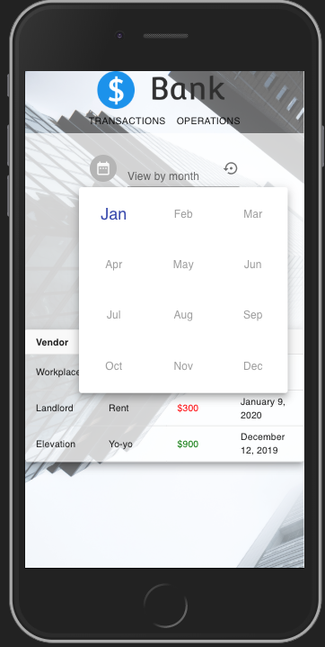
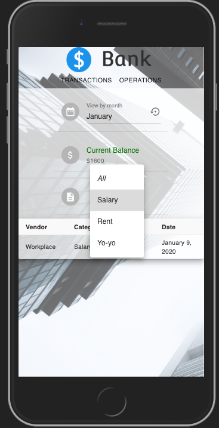
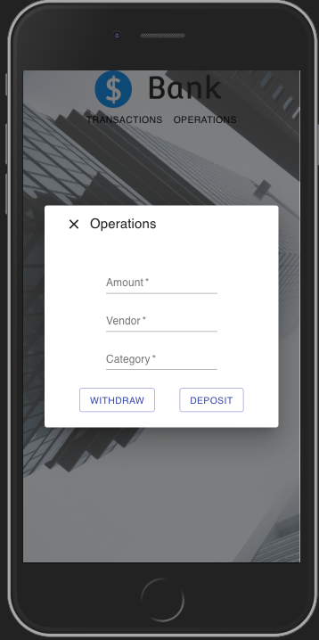

# Bank

Bank is a SPA built with React. The app demonstrates a virtual bank environment. 
you can view and make your transactions.

Demo: [https://rons-bank.herokuapp.com](https://rons-bank.herokuapp.com)

## Table Of Contents
- [Bank](#bank)
  - [Table Of Contents](#table-of-contents)
  - [Running the project](#running-the-project)
  - [Screenshots](#screenshots)
    - [Transactions](#transactions)
    - [Filter by month](#filter-by-month)
    - [Filter by category](#filter-by-category)
    - [Operations](#operations)
  - [Tech-stack](#tech-stack)

## Running the project
1. Clone the repo.
2. Run `npm install`.
3. Run `npm run build`
4. Run `mongod`
5. Run `npm start`.
6. Navigate to `http://localhost:4000`.

## Screenshots

### Transactions
An overview of all your transactions. You can select another month/category with the dropdowns and view your current balance. 

### Filter by month

### Filter by category

### Operations
Fill out the inputs and then click *Deposit* or *Withdraw* to add a new transactions.

## Tech-stack
1. React, Material-UI, Axios and MobX.
2. Express (Node.js), Mongoose (MongoDB).